# Spring Boot Shopping Cart REST API Demo
**Tech/Frameworks used:**
- Spring Boot
- MySQL
- JPA

## Setup Instructions
	TODO

## REST API

**Persons**  
_**1. List all persons**_   
`GET /api/persons`  
Returns a JSON array of all person entities in database. If no entities are present, returns an empty array.  

*HTTP Status Response Codes*   
`200` OK

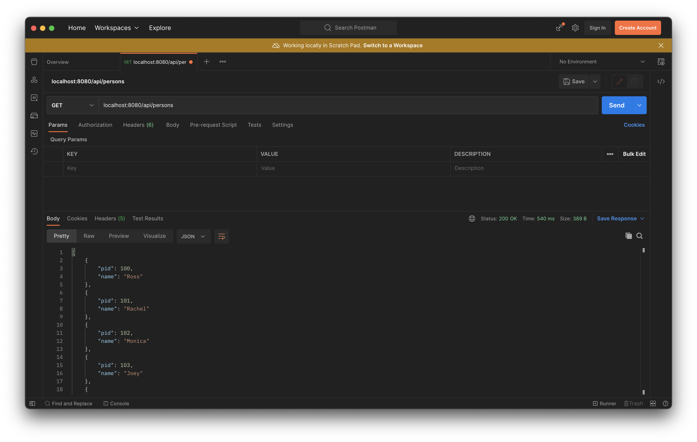

_**2. Find a person by ID**_   
`GET /api/persons/{pid}`   
Returns JSON object of the person entity with ID specified in the query.   

*Path Parameters*   
`pid` The unique identifier of the person. [int]   

*HTTP Status Response Codes*   
`200` OK   
`404` Not Found   

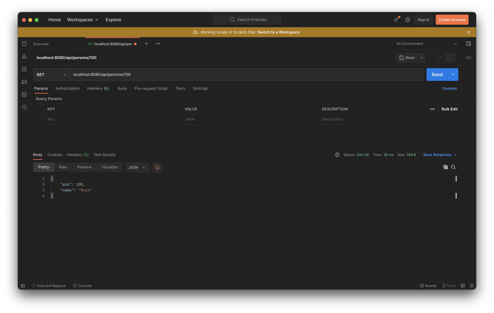

_**3. Add a person**_   
`POST /api/persons`   
Add a person entity to the database.   

*Body Parameters*   
`pid` The unique identifier of the person [int]   
`name` The name of the person [string]   

*HTTP Status Response Codes*   
`200` OK   

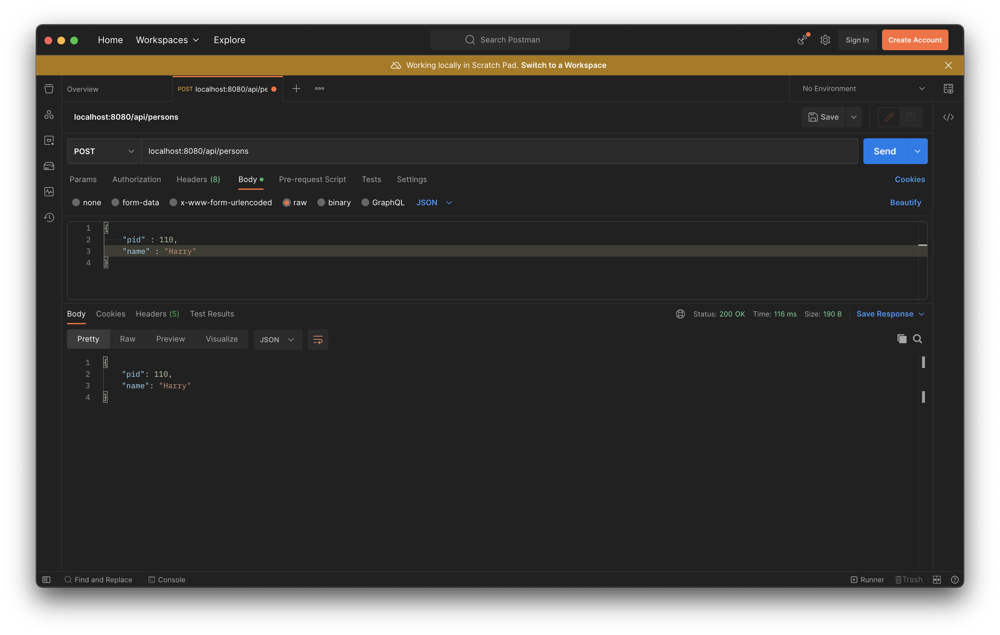

**Items**   
_**1. List all items**_   
`GET /api/items`   
Returns a JSON array of all item entities in database. If no entities are present, returns an empty array.   
*HTTP Status Response Codes*   
`200` OK   

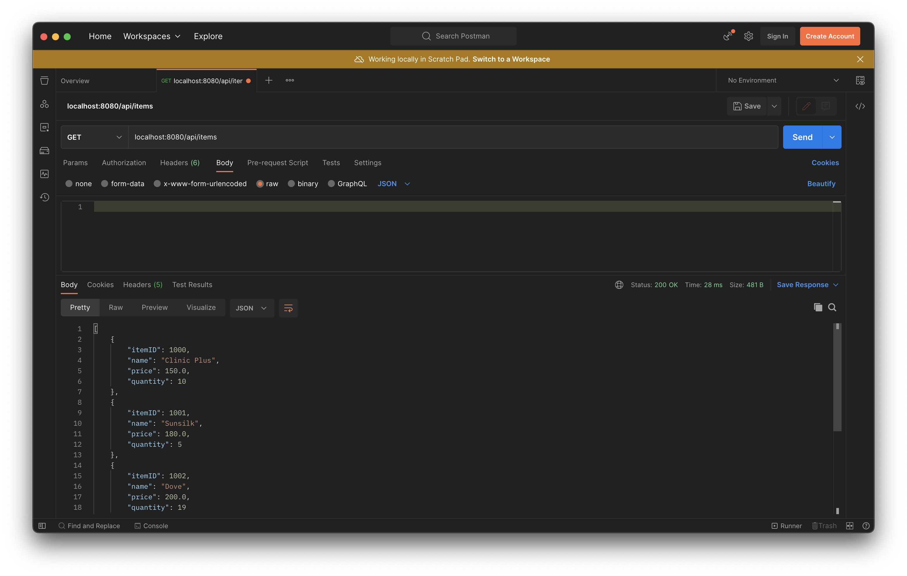

_**2. Find an item by ID**_   
`GET /api/items/{itemID}`   
Returns JSON object of the person entity with ID specified in the query.   

*Path Parameters*   
`itemID` The unique identifier of the person. [int]   

*HTTP Status Response Codes*   
`200` OK   
`404` Not Found   

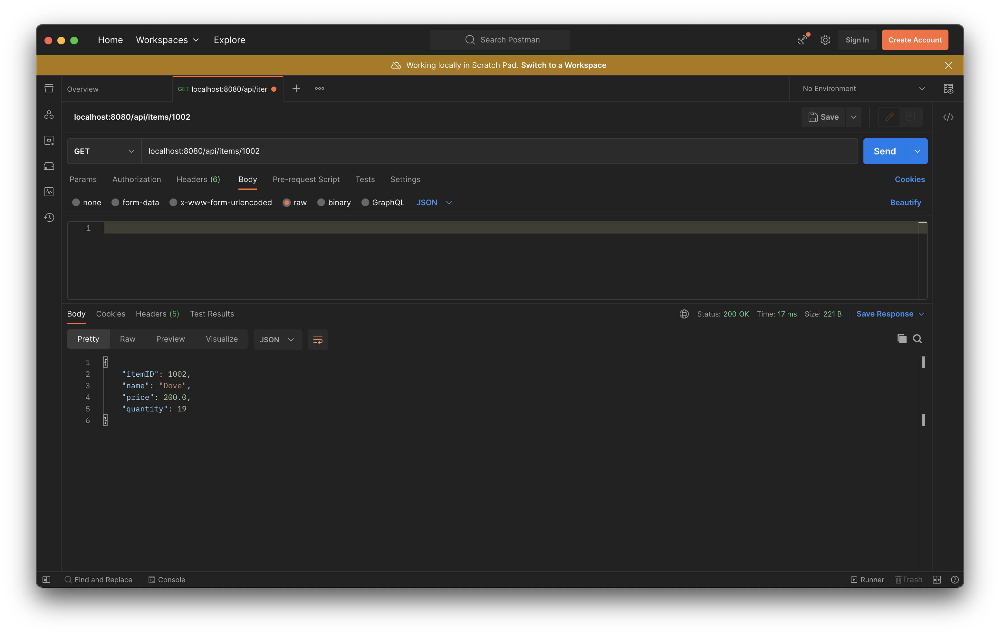

_**3. Add an item**_   
`POST /api/items`   
Add an item entity to the database.   

*Body Parameters*   
`itemID` The unique identifier of the person [int]    
`name` The name of the person [string]   
`price` The price of the item [double]   
`quantity` The number of items to be stored [int]   

*HTTP Status Response Codes*   
`200` OK   

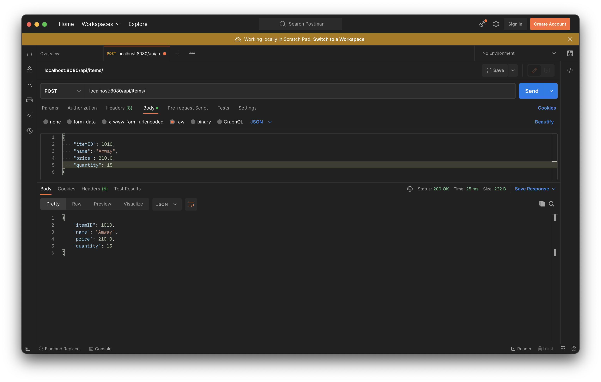

**Cart**   
_**1. List all carts**_   
`GET /api/carts`   
Returns a JSON array of all cart entities in database. If no entities are present, returns an empty array.   

*HTTP Status Response Codes*    
`200` OK   

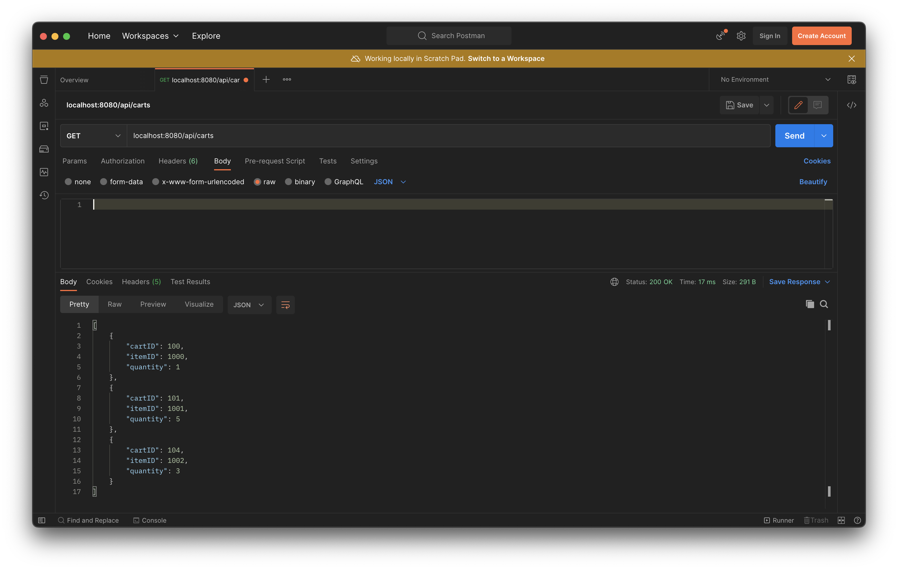  

_**2. Find a cart by ID**_   
`GET /api/carts/{cartID}`   
Returns JSON object of the cart entity with ID specified in the query.   

*Path Parameters*   
`cartID` The unique identifier of the cart. [int]   

*HTTP Status Response Codes*   
`200` OK   
`404` Not Found   

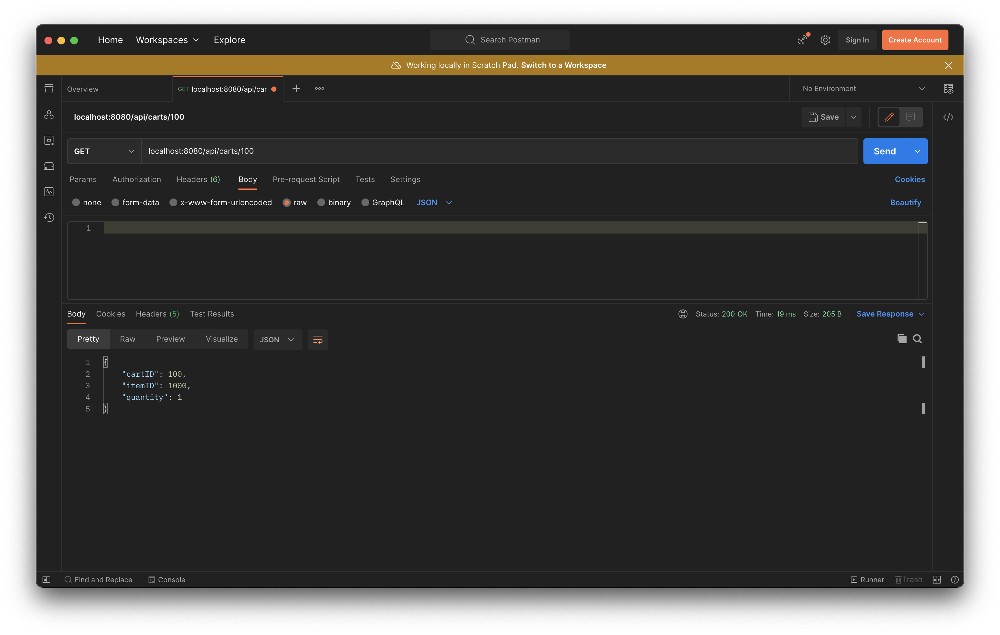

_**3. Add a cart**_   
`POST /api/carts`   
Add an cart to the database. Each cart is associated with a person entity, with the `cartID` of the cart entity being the same as the `pid` of the person entity. Each cart also as an `itemID`, therefore each cart can only have one type of item at a time.   

*Body Parameters*   
`cartID` The unique identifier of the cart [int]   
`itemID` The unique identifier of the item in the cart [int]   
`quantity` The number of items to be stored [int]   

*HTTP Status Response Codes*   
`200` OK   

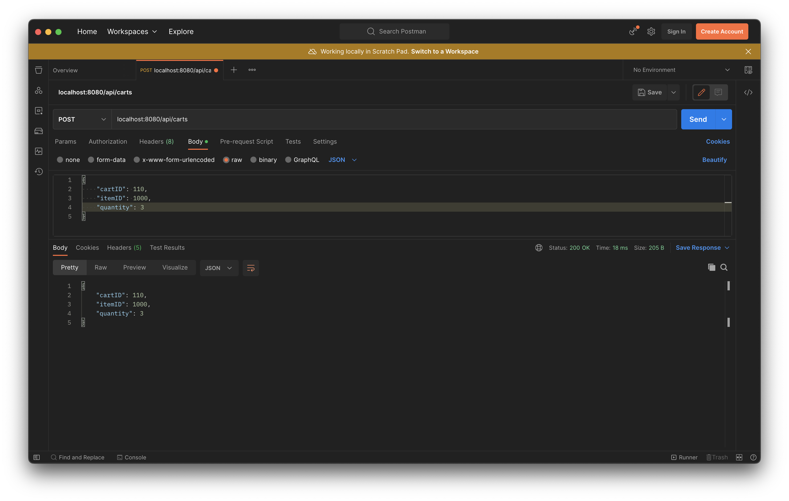

**Order**   
_**1. List all orders**_   
`GET /api/orders`   
Returns a JSON array of all orders. If no orders are present, returns an empty array.   

*HTTP Status Response Codes*   
`200` OK    

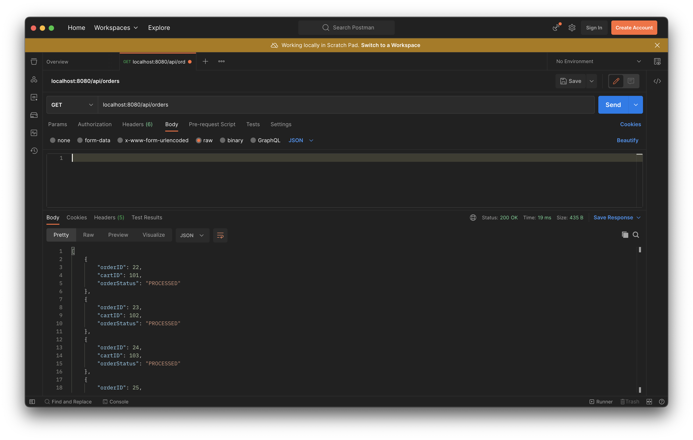

_**2. Find order by ID**_   
`GET /api/orders/{orderID}`   
Returns JSON object of the order with ID specified in the query.   

*Path Parameters*   
`orderID` The unique identifier of the order. [int]   

*HTTP Status Response Codes*   
`200` OK   
`404` Not Found   

_**3. Add an order**_   
`POST /api/orders/`   
Add an order. Every order is associated with a single cart entity. On making this API call, an order entity is created with an auto generated `orderID` and 	`orderStatus` set to PENDING   

*Body Parameters*   
`cartID` The unique identifier of the cart associated with the order [int]   

*HTTP Status Response Codes*   
`200` OK   

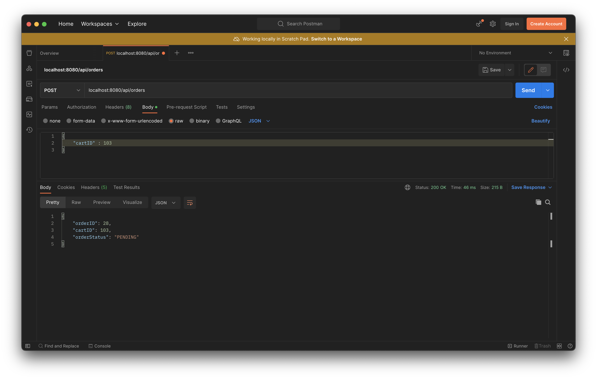

_**4. Place an order**_   
`PATCH /api/orders/{orderID}`   
Places an order with the specified `orderID`. Changes the `orderStatus` to PROCESSED and reduces the quantity of the item included in the order.   

*Path Parameters*   
`orderID` The unique identifier of the order. [int]   

*HTTP Status Response Codes*   
`200` OK   
`400` Bad Request   
`404` Order not found   

